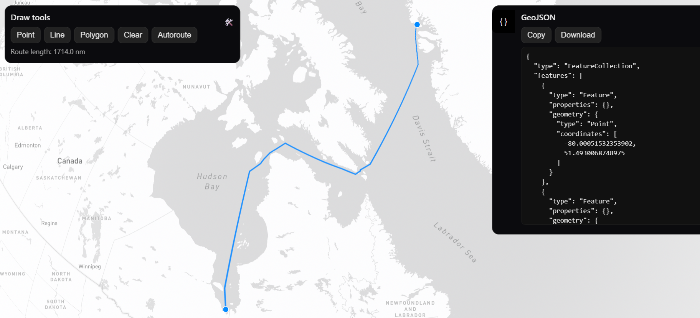

# Nautical Route Generator

[**▶ Live Demo**](http://184.72.204.18:8000/)

An interactive web app for planning **sailing or boating routes**.  
Draw waypoints on the map and let the app automatically calculate the safest path over open water, avoiding land masses using an H3 hex-grid land mask.

---

## Features

- **Water-only autorouting** — Calculates a great-circle-based path that avoids land.
- **Draw tools** — Add points, lines, or polygons directly on the map.
- **Dock legs** — Automatically offsets route start/end points slightly offshore.
- **Manual editing** — Clear or redraw routes as needed.
- **GeoJSON export** — Copy or download your drawn/autorouted paths.

---

## How Autorouting Works

When you select two or more waypoints and click **Autoroute**, the app:

1. **Snaps endpoints offshore**  
   - Uses an H3 grid and land mask to nudge start/end points into water if they’re on land or a dock.

2. **Quick land-check**  
   - If the straight great-circle segment between points is entirely water, it uses that directly.

3. **Fine-grid A\***  
   - Builds a “corridor” of allowed water cells between points.
   - Runs an A\* pathfinding search to find the shortest water-only route within the corridor.

4. **Macro skeleton fallback**  
   - At a lower H3 resolution, searches a broad path to outline a viable skeleton.
   - Refines each skeleton leg with fine-grid A\*.

5. **Recursive detour fallback**  
   - As a last resort, recursively tries perpendicular detours until a water path is found.

At each step, the route is checked for **land crossings** and rejected if any segment intersects land.

---

## Drawing Tools

Located in the **left-side sliding Tools menu**:

| Tool | Description |
|------|-------------|
| **Point** | Place a single coordinate on the map. Useful as a waypoint. |
| **Line** | Draw a freehand path by clicking multiple vertices. Double-click or click the last vertex to finish. |
| **Polygon** | Draw a closed area on the map. Double-click or click the last vertex to finish. |
| **Clear** | Remove all drawn features. |
| **Autoroute** | Generate a water-only route between your drawn waypoints. |

The **status line** below the buttons updates with current mode or routing results.

---

## How to Use

1. Open the app in your browser.
2. Use the **Point** or **Line** tool to place waypoints in the desired order.
3. Click **Autoroute** to generate the nautical route between waypoints.
4. Optionally copy or download the route as GeoJSON from the right-side panel.
5. Use **Clear** to reset and plan another route.

---

## Technical Notes

- **Map rendering:** [Mapbox GL JS](https://docs.mapbox.com/mapbox-gl-js/)
- **Spatial indexing:** [H3](https://h3geo.org/) hexagonal grid
- **Land detection:** Pre-computed land mask stored as a Bloom filter
- **Routing:** Custom hybrid algorithm combining great-circle math, corridor A\*, and macro-scale greedy search

---

## License

MIT — See [LICENSE](LICENSE) for details.
